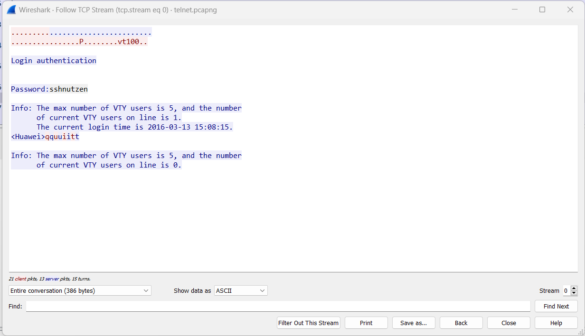
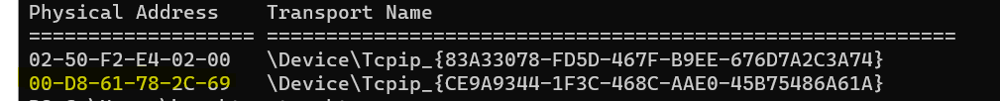
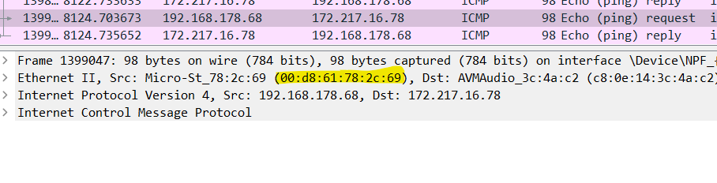
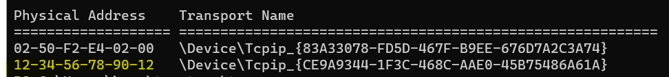
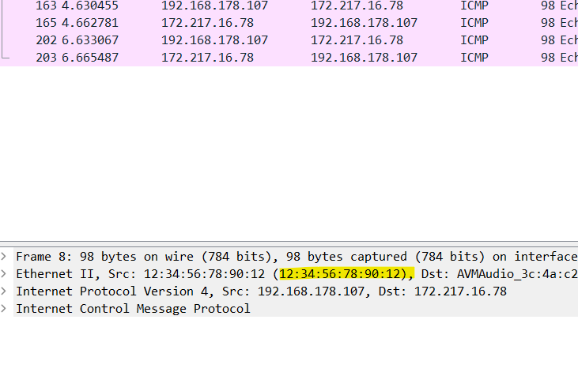

# Einsendeaufgabe zum Kapitel 2
<sup><sub>Ivo Valls / Matrikelnummer 916677</sub></sup>

## Aufgabe A: Telnet Passwort finden
a) Wireshark ist bei ParrotOS und Kali Linux vorinstalliert. Es kann ansonsten von der Wireshark-Seite heruntergeladen werden. In der Wireshark-Datei im Kurs (telnet.pcapng) ist eine Aufzeichnung eines Einlog-Vorgangs mit Telnet zu finden. Suchen Sie darin das Passwort.

Mit WireShark lässt sich das Passwort relativ einfach aus:



## Aufgabe B: Testscnan von nwsmooc.mooin.org
b) Verwenden Sie nmap/zenmap (bei ParrotOS vorinstalliert, bei Kali fehlt zenmap, ansonsten herunterladen), um verschiedene Scans des Testservers nwsmooc.mooin.org durchzuführen. Erklären Sie die Ergebnisse, wobei mindestens drei Tests mit jeweils unterschiedlichen Parametern durchgeführt werden müssen.

### Aufruf `nmap nwsmooc.mooin.org`:
```
knechtrootrecht@DESKTOP-2R9EMRV:/mnt/c/Users/knechtrootrecht/Documents/Uni/6. Semester/Netzwerksicherheit/ESA1$ nmap nwsmooc.mooin.org
Starting Nmap 7.80 ( https://nmap.org ) at 2023-04-11 17:30 CEST
Nmap scan report for nwsmooc.mooin.org (81.169.230.170)
Host is up (0.52s latency).                                                                     (1)
Other addresses for nwsmooc.mooin.org (not scanned): 2a01:238:4344:5000:e79a:888:dfb5:6b52      (2)
rDNS record for 81.169.230.170: h2524950.stratoserver.net                                       (3)
Not shown: 997 filtered ports                                                                   (4)
PORT    STATE SERVICE                                                                           (5)
22/tcp  open  ssh
80/tcp  open  http
443/tcp open  https

Nmap done: 1 IP address (1 host up) scanned in 72.12 seconds                                    (6)
```
   1. NMAP stellt fest der host ist UP 
   2. Andere festgestellte Adressen für den host nwsmooc.mooin.org. Hier die IPv6
   3. Reverse DNS Record für den host (Scheint bei Strato gehostet zu sein)
   4. Defaultmäßig werden nur die ersten 1000 Ports gescannt, 997 wurden ausgefiltert weil vermutlich geschlossen
   5. Gefundene offene Ports: 22,80 und 443
   6. Zusammenfassung: 1 Host gescannt in ~1 Minute

### Aufruf `nmap --script "vuln" nwsmooc.mooin.org`

```
Starting Nmap 7.80 ( https://nmap.org ) at 2023-04-11 17:54 CEST
Nmap scan report for nwsmooc.mooin.org (81.169.230.170)
Host is up (0.59s latency).
Other addresses for nwsmooc.mooin.org (not scanned): 2a01:238:4344:5000:e79a:888:dfb5:6b52
rDNS record for 81.169.230.170: h2524950.stratoserver.net
Not shown: 997 filtered ports
PORT    STATE SERVICE
22/tcp  open  ssh
|_clamav-exec: ERROR: Script execution failed (use -d to debug)
80/tcp  open  http
|_clamav-exec: ERROR: Script execution failed (use -d to debug)
|_http-csrf: Couldn't find any CSRF vulnerabilities.
|_http-dombased-xss: Couldn't find any DOM based XSS.
| http-enum:
|_  /icons/: Potentially interesting folder w/ directory listing                        (1)
| http-phpmyadmin-dir-traversal:
|   VULNERABLE:
|   phpMyAdmin grab_globals.lib.php subform Parameter Traversal Local File Inclusion
|     State: LIKELY VULNERABLE
|     IDs:  CVE:CVE-2005-3299
|       PHP file inclusion vulnerability in grab_globals.lib.php in phpMyAdmin 2.6.4 and 2.6.4-pl1 allows remote attackers to include local files via the $__redirect parameter, possibly involving the subform array.
|
|     Disclosure date: 2005-10-nil
|     Extra information:
|       ../../../../../etc/passwd not found.                                            (2)
|
|     References:
|       http://www.exploit-db.com/exploits/1244/
|_      https://cve.mitre.org/cgi-bin/cvename.cgi?name=CVE-2005-3299
|_http-stored-xss: Couldn't find any stored XSS vulnerabilities.
|_http-trace: TRACE is enabled
443/tcp open  https
|_clamav-exec: ERROR: Script execution failed (use -d to debug)
| http-csrf:
| Spidering limited to: maxdepth=3; maxpagecount=20; withinhost=nwsmooc.mooin.org
|   Found the following possible CSRF vulnerabilities:
|
|     Path: https://nwsmooc.mooin.org:443/
|     Form id:
|_    Form action: https://nwsmooc.mooin.org/
|_http-dombased-xss: Couldn't find any DOM based XSS.
| http-enum:
|   /wp-login.php: Possible admin folder                                                (3)
|   /robots.txt: Robots file
|   /readme.html: Wordpress version: 2
|   /: WordPress version: 6.2
|   /feed/: Wordpress version: 6.2
|   /wp-includes/images/rss.png: Wordpress version 2.2 found.
|   /wp-includes/js/jquery/suggest.js: Wordpress version 2.5 found.
|   /wp-includes/images/blank.gif: Wordpress version 2.6 found.
|   /wp-includes/js/comment-reply.js: Wordpress version 2.7 found.
|   /wp-login.php: Wordpress login page.
|   /wp-admin/upgrade.php: Wordpress login page.
|   /readme.html: Interesting, a readme.
|_  /icons/: Potentially interesting folder w/ directory listing
| http-fileupload-exploiter:
|
|     Couldn't find a file-type field.
|
|_    Couldn't find a file-type field.
|_http-passwd: ERROR: Script execution failed (use -d to debug)
|_http-stored-xss: Couldn't find any stored XSS vulnerabilities.
|_http-trace: TRACE is enabled
|_sslv2-drown:

Nmap done: 1 IP address (1 host up) scanned in 345.14 seconds
```

Dieser Befehl führt einen Scan nach bekannten sicherheitslücken aus. 
Einige interessante punkte hier sind: 

1. Ein Ordner dessen Inhalt gelistet werden kann
2. Ein möglicher einstiegspunkt über php-myadmin
3. Das abfragen gängiger Webverzeichnisse (in diesem Fall Wordpress)

### Aufruf mit `nmap -sTV  nwsmooc.mooin.org` 

Bei dem aufruf mit -sTV wird versucht die dienste auf den ersten tausend Ports zu identifiziert.
```
Starting Nmap 7.80 ( https://nmap.org ) at 2023-04-11 18:19 CEST
Nmap scan report for nwsmooc.mooin.org (81.169.230.170)
Host is up (0.031s latency).
Other addresses for nwsmooc.mooin.org (not scanned): 2a01:238:4344:5000:e79a:888:dfb5:6b52
rDNS record for 81.169.230.170: h2524950.stratoserver.net
Not shown: 997 filtered ports
PORT    STATE SERVICE  VERSION
22/tcp  open  ssh      OpenSSH 7.4 (protocol 2.0)                                               (1)
80/tcp  open  http     Apache httpd                                                             (2)
443/tcp open  ssl/http Apache httpd (PHP 8.1.15)                                                        

Service detection performed. Please report any incorrect results at https://nmap.org/submit/ .
Nmap done: 1 IP address (1 host up) scanned in 18.09 seconds
```
Ergebnisse:
1. Auf Port 22 läuft vermutlich ein OpenSSH in der version 7.4
2. Auf Port 80 und 443 läuft ein Apache Webserver

## Aufgabe C: 
c) Ebenfalls bereits bei ParrotOS und Kali schon vorinstalliert ist das Tool macchanger. Machen Sie sich mit dessen Möglichkeiten vertraut, wobei z.B. ein Video von HackerSploit nützlich sein kann. Senden Sie anschließend Datenverkehr mit gefälschter MAC-Adresse und zeichnen diesen mit Wireshark auf. Fertigen Sie geeignete Screenshots mit Erklärungen (wie müsste es richtig sein? wo ist die gefälschte MAC-Adresse in Wireshark zu sehen?) dazu an.

Mit dem befehl `getmac` erhält man die aktuelle MAC Adresse 



In WireShark sieht man dazu korrespondierend Folgende Requests:



Ändert man nun die MAC Adresse des Adapters wie folgt:



Kann in WireShark beobachtet werden das die Requests nun unter einer neuen MAC Adresse durchgeführt werden:



## Aufgabe D:
d) Verwenden Sie das bei ParrotOS und Kali Linux vorinstallierte WPScan (WordPress Vulnerability Scanner) und führen Sie einen Scan von https://nwsmooc.mooin.org durch. Erklären Sie die Ergebnisse.

Ein einfacher Aufruf ergab keine Ergebnisse aufgrund einer `403` Antwort des Servers:

```
knechtrootrecht@DESKTOP-2R9EMRV:/mnt/c/Users/knechtrootrecht/Documents/Uni/6. Semester/Netzwerksicherheit/ESA1$ wpscan --url https://nwsmooc.mooin.org
_______________________________________________________________
         __          _______   _____
         \ \        / /  __ \ / ____|
          \ \  /\  / /| |__) | (___   ___  __ _ _ __ ®
           \ \/  \/ / |  ___/ \___ \ / __|/ _` | '_ \
            \  /\  /  | |     ____) | (__| (_| | | | |
             \/  \/   |_|    |_____/ \___|\__,_|_| |_|

         WordPress Security Scanner by the WPScan Team
                         Version 3.8.22

       @_WPScan_, @ethicalhack3r, @erwan_lr, @firefart
_______________________________________________________________

[i] Updating the Database ...
[i] Update completed.


Scan Aborted: The target is responding with a 403, this might be due to a WAF. Please re-try with --random-user-agent
```

Mit der vorgeschlagenen Änderung (`--random-user-agent`) und einem Access token erhalten wir nun folgende Antwort:

```
knechtrootrecht@DESKTOP-2R9EMRV:/mnt/c/Users/knechtrootrecht/Documents/Uni/6. Semester/Netzwerksicherheit/ESA1$ wpscan --url https://nwsmooc.mooin.org --random-user-agent --api-token <SOME-TOKEN>
_______________________________________________________________
         __          _______   _____
         \ \        / /  __ \ / ____|
          \ \  /\  / /| |__) | (___   ___  __ _ _ __ ®
           \ \/  \/ / |  ___/ \___ \ / __|/ _` | '_ \
            \  /\  /  | |     ____) | (__| (_| | | | |
             \/  \/   |_|    |_____/ \___|\__,_|_| |_|

         WordPress Security Scanner by the WPScan Team
                         Version 3.8.22
       Sponsored by Automattic - https://automattic.com/
       @_WPScan_, @ethicalhack3r, @erwan_lr, @firefart
_______________________________________________________________

[+] URL: https://nwsmooc.mooin.org/ [81.169.230.170]
[+] Started: Tue Apr 11 21:54:03 2023

Interesting Finding(s):

[+] Headers                                                                 (1)
 | Interesting Entries:
 |  - Server: Apache
 |  - X-Powered-By: PHP/8.1.15
 | Found By: Headers (Passive Detection)
 | Confidence: 100%

[+] robots.txt found: https://nwsmooc.mooin.org/robots.txt                  (2)
 | Interesting Entries:
 |  - /wp-admin/
 |  - /wp-admin/admin-ajax.php
 | Found By: Robots Txt (Aggressive Detection)
 | Confidence: 100%

[+] WordPress readme found: https://nwsmooc.mooin.org/readme.html           (3)
 | Found By: Direct Access (Aggressive Detection)
 | Confidence: 100%

[+] The external WP-Cron seems to be enabled: https://nwsmooc.mooin.org/wp-cron.php
 | Found By: Direct Access (Aggressive Detection)
 | Confidence: 60%
 | References:
 |  - https://www.iplocation.net/defend-wordpress-from-ddos
 |  - https://github.com/wpscanteam/wpscan/issues/1299

[+] WordPress version 6.2 identified (Latest, released on 2023-03-29).
 | Found By: Rss Generator (Passive Detection)
 |  - https://nwsmooc.mooin.org/feed/, <generator>https://wordpress.org/?v=6.2</generator>
 |  - https://nwsmooc.mooin.org/comments/feed/, <generator>https://wordpress.org/?v=6.2</generator>
 |
 | [!] 1 vulnerability identified:                                          (4)
 |
 | [!] Title: WP <= 6.2 - Unauthenticated Blind SSRF via DNS Rebinding
 |     References:
 |      - https://wpscan.com/vulnerability/c8814e6e-78b3-4f63-a1d3-6906a84c1f11
 |      - https://cve.mitre.org/cgi-bin/cvename.cgi?name=CVE-2022-3590
 |      - https://blog.sonarsource.com/wordpress-core-unauthenticated-blind-ssrf/

[+] WordPress theme in use: twentysixteen
 | Location: https://nwsmooc.mooin.org/wp-content/themes/twentysixteen/
 | Last Updated: 2023-03-29T00:00:00.000Z
 | Readme: https://nwsmooc.mooin.org/wp-content/themes/twentysixteen/readme.txt
 | [!] The version is out of date, the latest version is 2.9
 | Style URL: https://nwsmooc.mooin.org/wp-content/themes/twentysixteen/style.css?ver=20221101
 | Style Name: Twenty Sixteen
 | Style URI: https://wordpress.org/themes/twentysixteen/
 | Description: Twenty Sixteen is a modernized take on an ever-popular WordPress layout — the horizontal masthead ...
 | Author: the WordPress team
 | Author URI: https://wordpress.org/
 |
 | Found By: Css Style In Homepage (Passive Detection)
 | Confirmed By: Css Style In 404 Page (Passive Detection)
 |
 | Version: 2.8 (80% confidence)
 | Found By: Style (Passive Detection)
 |  - https://nwsmooc.mooin.org/wp-content/themes/twentysixteen/style.css?ver=20221101, Match: 'Version: 2.8'

[+] Enumerating All Plugins (via Passive Methods)

[i] No plugins Found.

[+] Enumerating Config Backups (via Passive and Aggressive Methods)
 Checking Config Backups - Time: 00:00:05 <=================================================================================================================================================> (137 / 137) 100.00% Time: 00:00:05

[i] No Config Backups Found.                                        (5)

[+] WPScan DB API OK
 | Plan: free
 | Requests Done (during the scan): 2
 | Requests Remaining: 73

[+] Finished: Tue Apr 11 21:54:14 2023
[+] Requests Done: 174
[+] Cached Requests: 7
[+] Data Sent: 58.444 KB
[+] Data Received: 292.25 KB
[+] Memory used: 250.953 MB
[+] Elapsed time: 00:00:11
```

### Interpretation der Ergebnisse

Folgende Dinge konnten mit einem oberflächlichen Scan gefunden werden:
1. Es ist nicht die neueste PHP Version installiert (aktuell wäre 8.2.3)
2. Die Datei /wp-admin/admin-ajax.php ist öffentlich einsehbar, aber von ROBOTS.TXT von Suchmaschinen verborgen wurde
3. Die standard README.md ist noch vorhanden, dies könnte darauf hindeuten das andere defaults auch belassen wurden
4. Eine Sicherheitslücke wurde gefunden (CVE-2022-3590) welche es erlaubt auf nicht öffentliche Hosts der Installation zuzugreifen
5. Backups sind nicht öffentlich zugänglich (Gute Nachricht)

Aggressivere Scans, oder ein Versuch eines Bruteforcings des Adminlogins per Wörterbuch o.Ä. wurde nicht durchgeführt.

# Aufgabe e) 
Mit "Google Hacking" ist gemeint, dass man die Google Suche zum Auffinden von Softwareinstallationen mit Schwachstellen nutzen kann. Eine Sammlung von Beispielen ist bei exploit-db.com/google-hacking-database/ zu finden. Erklären Sie anhand von drei selbstgewählten Beispielen, was man damit herausfinden kann.

## Beispiel `ext:ini intext:env.ini`

Sucht Dateien mit der Endung `.ini` und dem textinhalt `env.ini`. Hiermit kann man gängige Konfigurationsdateien finden, welche unter umständen wichtige informationen wie z.B. Passwörter enthalten. 

## Beispiel `intitle:phaser inurl:/frameprop.htm`

Findet PHASER Drucker deren Webinterface offen am Netz hängt

Kann als sprungbrett in ein Netzwerk genutzt werden oder einfach nur für allgemeinen Schabernack.

## Beispiel `intitle:"Bosch Security Systems" "LIVEPAGE" + "SETTINGS" -.net -.com`

Findet diverse Bosh Security Systeme mit offenen Webcams, wie zum Beispiel ein System welches zum einem Flughafen in Mittelamerika gehört. 