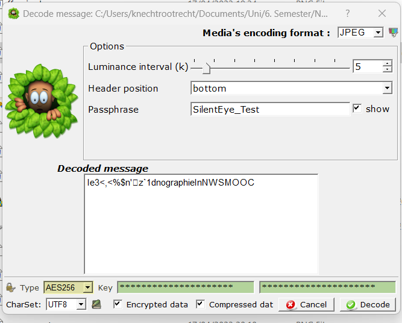

# Aufgabe A

Testen Sie den Server nwsmooc.mooin.org mit der SSL-Testseite von Qualys und erklären Sie die Ergebnisse. Erklären Sie für eine weitere Webpräsenz, die als "Recent Worst" bewertet wird, was bei dieser nicht stimmt. "Recent Worst" ist eine Liste auf der rechten Seite der Testseite. Zur besseren Nachvollziehbarkeit bitte Screenshots hinzufügen.

## Antowrt

**Ergebnisse für `nwsmooc.mooin.org`:**

Allgemeines Rating A+.

Dies entspricht einem guten Rating. 

Potentielle Verbesserungen die vorgeschlagen werden:

- Fehlender [DNS CAA Record](https://tools.ietf.org/html/rfc6844) im DNS Record des Servers. Hiermit kann eine ausstellende CA sicherstellen, dass sie ein Zertifikat für die richtige Seite ausstellt, indem sie überprüft ob sie im DNS record als ausstellende CA gelistet wird. Dies soll verhindern, dass jemand ein gültiges Zertifikat für eine Seite ausstellt, bei welcher er nicht in Kontrolle des DNS Eintrages ist.
- Einige ältere Clients werden nicht mehr unterstützt, dies kann je nach Ausrichtung der Seite zu ungewünschten Problemen führen.
- Der Server indiziert keine Präferenz für die stärksten verfügbaren Ciphersuites, unterstütz jedoch nur moderne.

**Ergebnisse für `identity.dau.edu`:**

Allgemeines Rating : T

Dies entspricht einem "schreklichen" (terrible) Rating. Jedoch nur wenn man berücksichtigt, das das Zertifikat ein selbst ausgestelltes ist. 

Weitere Probleme:
- Das Zertifikat ist seit 2021 abgelaufen.
- Es werden schwache Ciphersuites unterstützt (sollte man im Webserver deaktivieren)
- 

# Aufgabe b)
Führen Sie den Client-Test von Qualys aus und erklären Sie die Ergebnisse.

## Antwort
Ergebnis mit Edge:

- Der Browser unterstützt aktuelle Protokolle.
- Er ist nicht anfällig für die folgenden Vulns: CurveBall, Logjam, FREAK und POODLE
- Es werden aktuelle aber auch einige als schwach eingestellte Ciphersuites akzeptiert, dies kann ein Sicherheitsrisiko darstellen.
- Gängige features (WebSockets, CSS ...) werden unterstützt

# Aufgabe c)
Rufen Sie die Testwebseiten https://expired-demo.pca.dfn.de/ sowie https://revoked-demo.pca.dfn.de/ mit Firefox und mit Google Chrome auf. Erklären Sie, was passiert. Sind die Resultate bei allen vier Tests so wie erwartet?

Der Browser Lehnt die Verbindung mit den Seiten ab, da die Zertifikate abgelaufen sind (Kann durch den user mit einer weiteren Bestätigung ignoriert werden)

Chrome:

Firefox:

Alle Zeigen den gleichen Fehler an, vermutlich weil das zurückgezogene Zertifikat mittlerweile auch abgelaufen ist.

Aufgabe d)

d) Installieren Sie VeraCrypt auf Ihrem Rechner. Hierzu erhalten Sie zusätzlich eine VeraCrypt-Datei. In der Datei ist ein normaler und ein versteckter Container zu finden, die jeweils eine Datei enthalten. Das Passwort für den normalen Container ist der Exponent e des RSA-Schlüssels vom nwsmooc.mooin.org-Server. Dokumentieren Sie Ihre Vorgehensweise mit Screenshots und geben Sie anschließend das im versteckten Container gefundene Kennwort an.

Tipp: Zur Bedienung von VeraCrypt können Sie sich beispielsweise eine

e) Installieren Sie SilentEye auf Ihrem Rechner und untersuchen Sie die bereitgestellten Beispieldateien. Eine Datei enthält ein verstecktes Kennwort, die andere eine Datei. Die notwendigen Einstellungen können Sie der Aufgabe mit VeraCrypt entnehmen. Dokumentieren Sie Ihre Vorgehensweise mit Screenshots und geben Sie das gefundene Kennwort an.

Vorgehen:
1. Zertifikat im Browser herunterladen.
2. Zertifikat im ASN.1 browser decodiern und exponent extrahieren.

3. Container mit exponenten in VeraCrypt mounten

4. Den versteckten Container mit dem gefundenen Passwort mounten

5. Mittels gefundener Anleitung JPG und bmp Datei entsteganographieren

